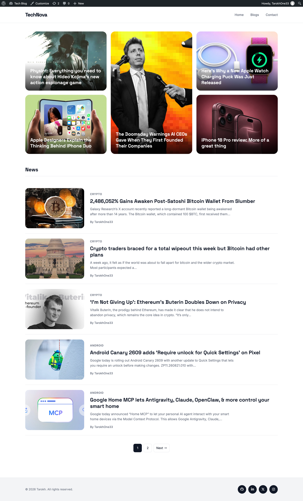
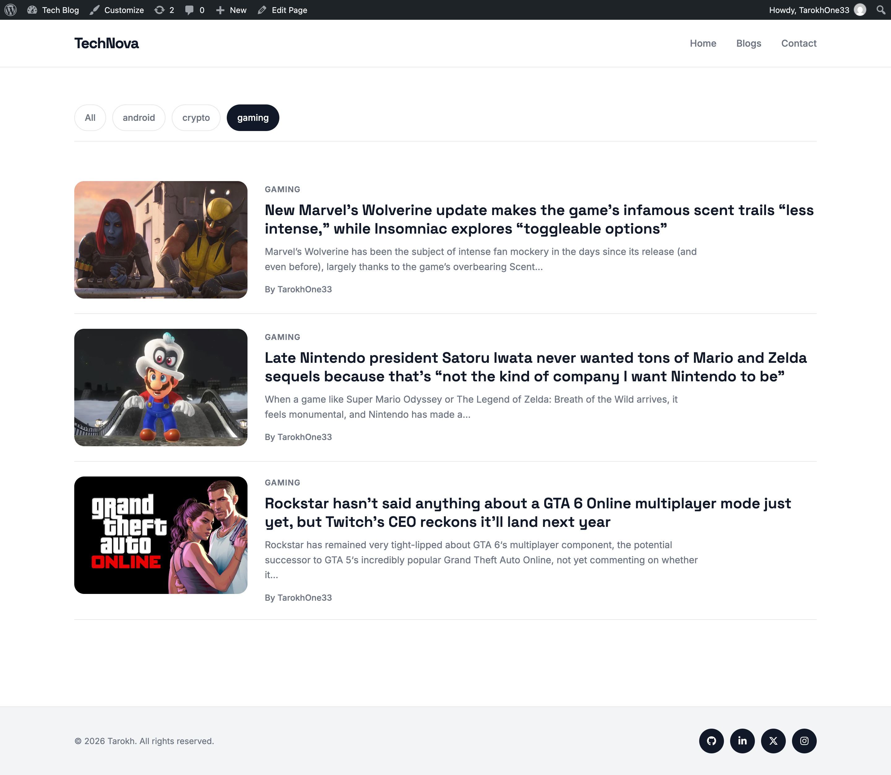
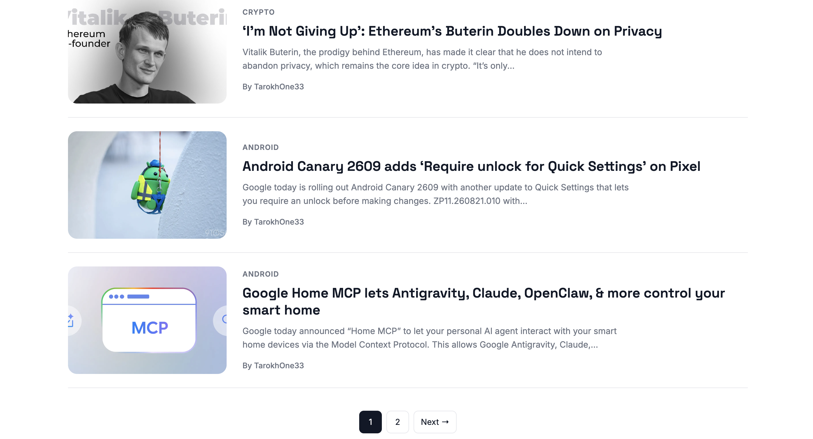
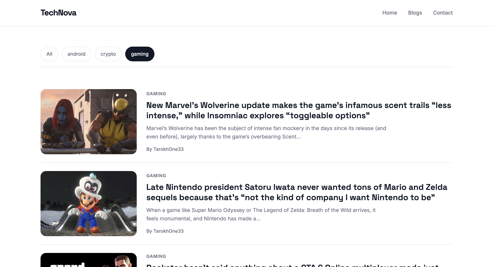
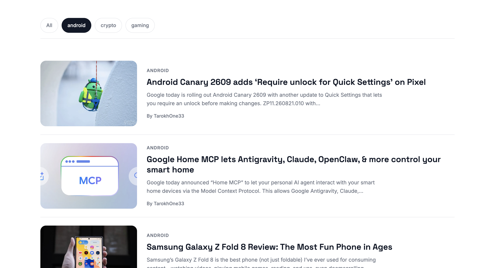
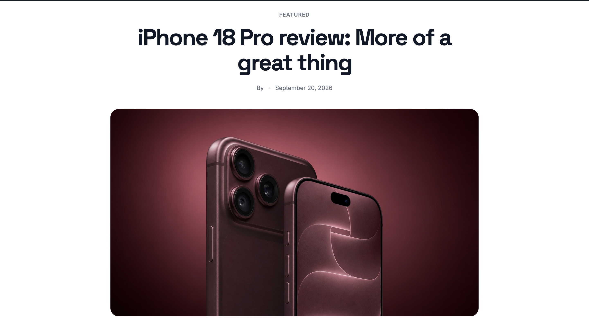
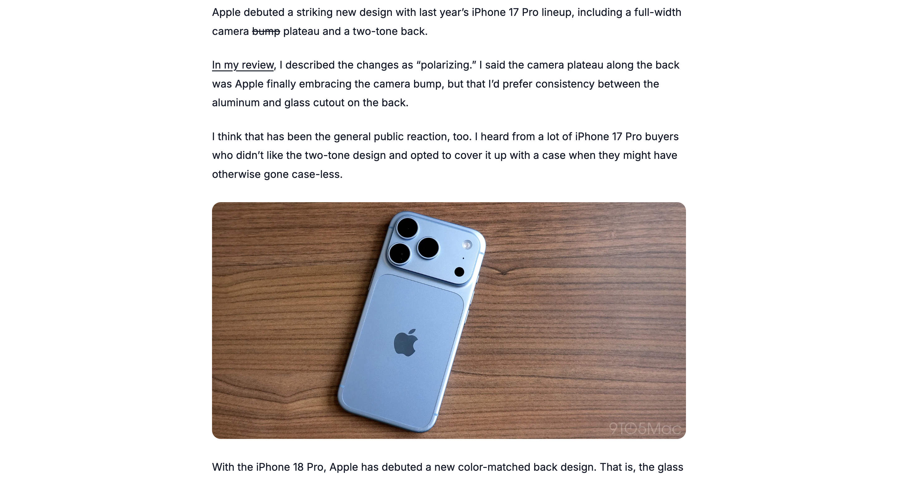
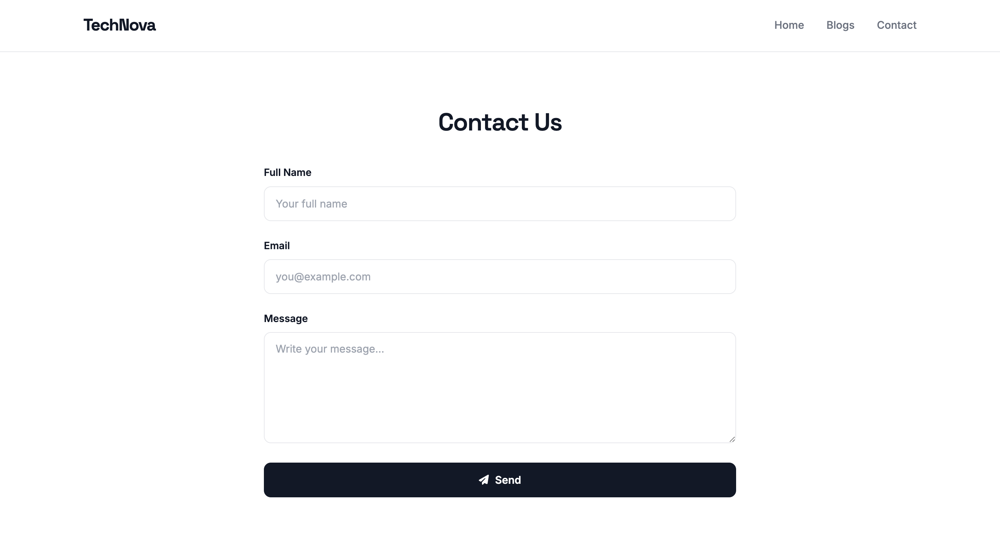

# TechBlog — WordPress Theme

A modern and responsive WordPress tech blog theme built from scratch using PHP, HTML, CSS, and JavaScript.

## Features

* Custom WordPress classic theme
* Fully responsive design
* Modern tech-focused UI
* Featured posts section
* News/blog section
* Individual single post pages
* Custom Blogs page
* Custom Contact page
* Responsive navigation
* Mobile-friendly layout
* Post pagination
* Category-based post organization
* Admin-controlled featured posts
* Font Awesome icons
* Google Fonts integration
* Custom JavaScript interactions

## Technologies

* WordPress
* PHP
* HTML5
* CSS3
* JavaScript
* MySQL
* Font Awesome
* Google Fonts

## Screenshots

### Full Page



<br><br>




### Homepage


<br><br>



<br><br>

### Blog Page



<br><br>



<br><br>

### Article



<br><br>



<br><br>

### Contact



<br><br>

## Project Structure

```text
tech_blog1/
├── assets/
│   └── js/
│       └── main.js
├── screenshots/
│   ├── home-page.png
│   ├── home-page2.png
│   ├── blogs-page.png
│   ├── blogs-page2.png
│   ├── article-page.png
│   ├── article-page2.png
│   └── contact-page.png
├── footer.php
├── functions.php
├── header.php
├── index.php
├── page-blogs.php
├── page-contact.php
├── single.php
├── style.css
└── README.md
```
